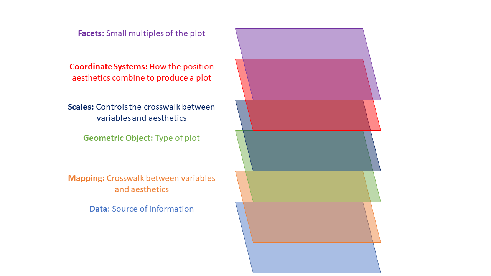
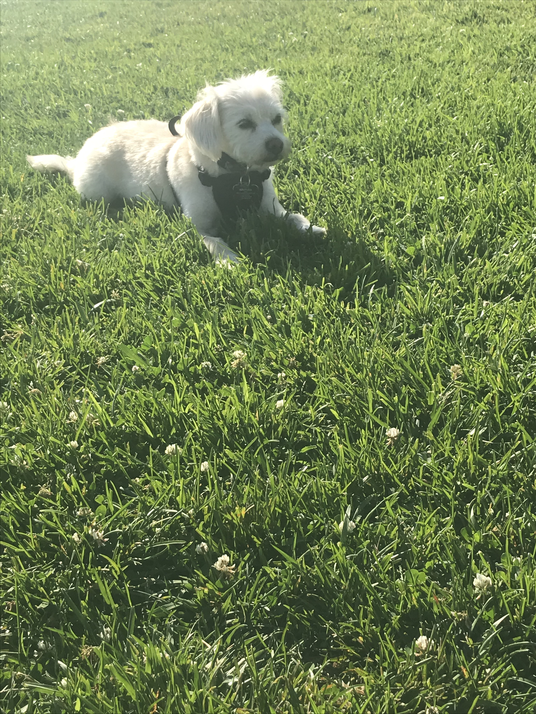

## What is ggplot2?
```{r, include = FALSE}
library(xaringan)
library(palmerpenguins)
library(ggplot2)
library(dplyr)
```

```{r, include = FALSE}
penguins = filter(penguins, is.na(sex) == FALSE) %>%
 select(species, year, bill_length_mm, flipper_length_mm, body_mass_g, sex)
```

```{r, include = FALSE}
theme_set(
  theme(axis.text = element_text(size = 12),
        axis.title = element_text(size = 13),
        strip.text = element_text(size = 13),
        legend.text = element_text(size = 10),
        legend.title = element_text(size = 11))
)
```

.pull-left[
<br><br>An R package that is part of the tidyverse
<br><br>Specifically designed for the creation of plots 
<br><br>Easy to iterate and build on
]

.pull-right[
```{r ggplot-image, eval = TRUE, echo = FALSE, out.width= "50%", fig.align="center"}
knitr::include_graphics("supplemental_graphics/ggplot2.png")
```


]

---

## Quick FYI!

`ggplot2` is a huge package with a ton of functionality to create plots, this presentation will only skim the surface.   
<br><br>
This will be more of a "watch and learn" type of presentation versus a "follow along"  

<br>But all the code to generate plots will be visible and thus available to you! 


---
## Data: {palmerpenguins} R package

Contains size measurements for three penguin species observed on three islands in the Palmer Archipelago, Antarctica.

```{r, eval = TRUE, echo = FALSE}
penguins %>%
  select(species, body_mass_g, bill_length_mm, sex) %>%
  head %>%
  knitr::kable() 
```


---
class: center, middle
## So.. what's the gg in ggplot2?

<br><br>
#ggplot2 is the **g**rammar of **g**raphics **plot** ... 2


---
## Grammar of Graphics

>  "Grammar of graphics is a tool that enables us to concisely describe the components of a graphic"
    
<br><br>
**The Grammar of Graphics by Leland Wilkinson**
* Proposed an idea of building up a graphic from multiple "layers of data" 

<br><br>    
**A Layered Grammar of Graphics by Hadley Wickham**  
* "Layers" implemented in ggplot2 (with some tweaks and expansion on the concept)
* Thinking behind the implementation of the concept in `ggplot2()`


---
## Grammar of Graphics

```{r, echo = FALSE, eval = TRUE, out.width= "80%", fig.align='center'}

```
---
## Grammar of Graphics - Essentials


.pull-left[
**Data**
```{r data-base, eval = FALSE}
ggplot( )
```
]

.pull-right[
<br> 
The source of information for your visualization.
<br><br>`ggplot()` requires your data to be 'tidy'
* Every variable has a column
* Every observation has a row
]

---
## Grammar of Graphics - Essentials


.pull-left[
**Data**
```{r eval = FALSE}
ggplot(data = penguins)

penguins %>%
  ggplot()
```
]

.pull-right[
<br> 
The source of information for your visualization.
<br><br>`ggplot()` requires your data to be 'tidy'
* Every variable has a column
* Every observation has a row
]

---
## Grammar of Graphics - Essentials

.pull-left[
```{r plot-label, eval=FALSE}
ggplot(data = penguins)
```
]

.pull-right[
```{r plot-label-out, ref.label="plot-label", echo=FALSE}
```
]

---
## Grammar of Graphics - Essentials

.pull-left[
**Mapping**
```{r mapping-base-1, eval = FALSE}
aes(x = , 
    y = )
```
]

.pull-right[
<br>
Crosswalk between variables in the dataset and how they are visualized in the plot
* body mass g -> x
* bill length mm -> y
]

---
## Grammar of Graphics - Essentials

.pull-left[
**Mapping**
```{r mapping-base-2, eval = FALSE}
aes(x = body_mass_g, 
    y = bill_length_mm)
```
]

.pull-right[
<br>
Crosswalk between variables in the dataset and how they are visualized in the plot
* body mass g -> x
* bill length mm -> y
]

---
## Grammar of Graphics - Essentials

.pull-left[
**Geometric Object**
```{r geom-base, eval = FALSE}
geom_*()
```
]

.pull-right[
<br>
Controls the type of plot you create
* geom_point() = scatter plot
* geom_line() = line plot
* geom_col() or geom_bar() = bar graph

...and more!!!
]

---
## Grammar of Graphics - Essentials

.pull-left[
**Geometric Object**
```{r geom-base-2, eval = FALSE}
geom_point()
```
]

.pull-right[
<br>
Controls the type of plot you create
* geom_point() = scatter plot
* geom_line() = line plot
* geom_col() or geom_bar() = bar graph

...and more!!!
]

---
## Grammar of Graphics - Essentials

.pull-left[
**Mapping + Geometric Object**
```{r mapping-base-3, eval = FALSE}
# Method 1 
ggplot(data = penguins,
       aes(x = body_mass_g, 
           y = bill_length_mm))
       
# Method 2
ggplot(data = penguins) +
  geom_point(aes(x = body_mass_g, 
           y = bill_length_mm))

# Method 3
ggplot() +
  geom_point(data = penguins,
         aes(x = body_mass_g, 
           y = bill_length_mm))
```
]

.pull-right[
<br>
Method 1: Best when using one data set and one aesthetic mapping
<br><br>
Method 2: Best when using one data set, and multiple geoms + aesthetic mappings
<br><br>
Method 3: Best when using multiple data sets, and multiple geoms + aesthetic mappings
]

---
## Grammar of Graphics - Essentials

.pull-left[
```{r plot-label-2, eval=FALSE}
ggplot(data = penguins,
       aes(x = body_mass_g, #<<
           y = bill_length_mm)) #<<
```
]

.pull-right[
```{r plot-label-2-out, ref.label="plot-label-2", echo=FALSE}
```
]


---
## Grammar of Graphics - Essentials

.pull-left[
```{r plot-label-3, eval=FALSE}
ggplot(data = penguins,
       aes(x = body_mass_g,
           y = bill_length_mm)) +
  geom_point() #<<
```
<br>Understands the following aesthetics
* x
* y
* alpha
* colour
* fill
* shape
* size
* etc.
]

.pull-right[
```{r plot-label-3-out, ref.label="plot-label-3", echo=FALSE}
```
]


---
## Grammar of Graphics - Essentials

.pull-left[
```{r plot-label-4, eval=FALSE}
ggplot(data = penguins,
       aes(x = body_mass_g,
           y = bill_length_mm,
           colour = sex)) + #<<
  geom_point()
```
<br><br>Add another dimension to the plot 
<br>by using `colour = `
]

.pull-right[
```{r plot-label-4-out, ref.label="plot-label-4", echo=FALSE}
```
]

---
## Grammar of Graphics - Essentials
.pull-left[
```{r plot-label-6, eval=FALSE}
ggplot(data = penguins,
       aes(x = body_mass_g,
           y = bill_length_mm)) +
  geom_point(aes(shape = as.factor(sex))) #<<

```
<br><br>Change the shape of the scatter plot, by using `aes()`

]


.pull-right[
```{r plot-label-6-out, ref.label="plot-label-6", echo=FALSE}
```
]

---
## Grammar of Graphics - Essentials
.pull-left[
```{r plot-label-5, eval=FALSE}
ggplot(data = penguins,
       aes(x = body_mass_g,
           y = bill_length_mm)) +
  geom_point(colour = "blue") #<<

```
<br><br>Map an aesthetic to a fixed value, by calling it outside of `aes()`

]


.pull-right[
```{r plot-label-5-out, ref.label="plot-label-5", echo=FALSE}
```
]

---
## Grammar of Graphics - Essentials
.pull-left[
```{r plot-label-7, eval=FALSE}
ggplot(data = penguins,
       aes(x = body_mass_g,
           y = bill_length_mm)) +
  geom_point(shape = 21, #<<
             colour = "blue", #<<
             fill = "red") #<<

```
<br><br>For shapes (or geoms) that have a border you can make the border (colour) and the inside (fill) different colors. 

]

.pull-right[
```{r plot-label-7-out, ref.label="plot-label-7", echo=FALSE}
```
]

---
## Grammar of Graphics - Essentials

.pull-left[
```{r plot-label-8, eval=FALSE, warning = FALSE}
g = #<<
  ggplot(data = penguins,
       aes(x = body_mass_g,
           y = bill_length_mm,
           colour = sex)) +
  geom_point()

g #<<
```
<br><br> Save your `ggplot` to an object! This object will be used to add additional layers in our graphic

]

.pull-right[
```{r plot-label-8-out, ref.label="plot-label-8", echo=FALSE, warning = FALSE}
```
]

---
## Grammar of Graphics - Essentials

<br>You can change the labels of the axes, as well as modify the limits of the axes.  

<br><br>This is done by using:
* `xlab()` and `ylab()` to change the labels
* `xlim()` and `ylim()` to change the limits

<br>Note this can also be done by using `labs()` - to be covered later!

---
## Grammar of Graphics - Essentials
.pull-left[
```{r, eval = FALSE}
g +
  xlab("Body Mass (g)") +
  ylab("Bill Length (mm)")
```
<br>Modified labels using `xlab()` and `ylab()`
]

.pull-right[
```{r, echo = FALSE}
g +
  xlab("Body Mass (g)") +
  ylab("Bill Length (mm)")
```
]


---
## Grammar of Graphics - Essentials
.pull-left[
```{r, eval = FALSE}
g +
  xlim(3000, 4000)
```
<br> Limiting the x-axis to body mass between 3000 and 4000 g
]

.pull-right[
```{r, echo = FALSE, warning = FALSE}
g +
  xlim(3000, 4000)

```
]

---
## Additional Layer 1: Scales

<b>Controls how the data is mapped to the aesthetic</b>

<br>Two main scale methods:
* Position Scales -> Affects your axes
* Color Scales -> Affects your colors/legends

.pull-left[
<br>
<b> Position Scales</b>
* Change labels
* Change breaks
* Modify limits
* Stat transformations
]

.pull-right[
<br>
<b> Color Scales </b>
* Change color mapping
* Change breaks
* Modify limits
]

---
## Additional Layer 1: Scales

<b>Controls how the data is mapped to the aesthetic</b>

<br>All scale functions tend to follow a similar formula:  
`scale` + `_ ` + `<aes>` + `_` + `<type>` + `()`

<br>Where:
* aes = What variable do you want to change?
* type = What type of variable?  

---
## Additional Layer 1: Scales

<b>Controls how the data is mapped to the aesthetic</b>

<br>All scale functions tend to follow a similar formula:  
`scale` + `_ ` + `<aes>` + `_` + `<type>` + `()`

.pull-left[
<br>
If we wanted to use a different color palette for a continuous variable:
* aesthetic variable = color
* type of variable = continuous

`scale_color_continuous()`
]

.pull-right[
<br>
If we wanted to change the limits for the date variable on the x axis:
* aesthetic variable = x
* type of variable = date

`scale_x_date()`
]

---
## Additional Layer 1: Scales

.pull-left[
<b> Position scales - change your axes </b>
```{r, eval = FALSE, echo = TRUE}
g + 
  scale_x_continuous(
    limits = c(3000, 4000))
```
]

.pull-right[
```{r, eval = TRUE, echo = FALSE, warning= FALSE}
g + scale_x_continuous(limits = c(3000, 4000))
```
]

---
## Additional Layer 1: Scales

.pull-left[
<b> Position scales - change your axes </b>
```{r, eval = FALSE, echo = TRUE}
g + 
  scale_x_continuous("Body Mass (g)")
```
]

.pull-right[
```{r, eval = TRUE, echo = FALSE, warning= FALSE}
g + scale_x_continuous("Body Mass (g)")
```
]

---
## Additional Layer 1: Scales

.pull-left[
<b> Position scales - change your axes </b>
```{r, eval = FALSE, echo = TRUE}
g + 
  scale_x_continuous(
    breaks = c(4000, 6000))
```
]

.pull-right[
```{r, eval = TRUE, echo = FALSE, warning= FALSE}
g + scale_x_continuous(breaks = c(4000, 6000))
```
]

---
## Additional Layer 1: Scales

.pull-left[
<b> Colour scales - change your legends </b>
```{r, eval = FALSE, echo = TRUE}
col = c("female" = "#ee6f57", 
        "male" = "#1f3c88")
g + 
  scale_color_manual(
    values = col)
```
]

.pull-right[
```{r, eval = TRUE, echo = FALSE, warning= FALSE}
col = c("female" = "#ee6f57", 
        "male" = "#1f3c88")
g + 
  scale_color_manual(values = col)
```
]
---
## Additional Layer 1: Scales

.pull-left[
<b> Colour scales - change your legends</b>
```{r, eval = FALSE, echo = TRUE}
col = c("female" = "#ee6f57", 
        "male" = "#1f3c88")
g + 
  scale_color_manual(
    values = col,
    labels = c("Female Penguins", 
               "Male Penguins"))
```
]

.pull-right[
```{r, eval = TRUE, echo = FALSE, warning= FALSE}
col = c("female" = "#ee6f57", 
        "male" = "#1f3c88")
g + 
  scale_color_manual(values = col,
                     labels = c("Female Penguins", "Male Penguins"))
```
]
---
## Additional Layer 2: Coordinate systems

Two main uses:
 + Combine two position aesthetics (x and y) to produce 2D position on plot 
 + Draw axes and panel backgrounds
 
<br>Commonly Used `coord_*()`: 
* `coord_flip()` - flips your position aesthetics 
* `coord_cartesian()` - cartesian plane
* `coord_polar()` - polar plane
* and more!


---
## Additional Layer 2: Coordinate systems

.pull-left[
`coord_flip()` flips your x and y axes
```{r, eval = FALSE}
g + coord_flip()
```
]

.pull-right[
```{r, echo = FALSE, warning = FALSE}
g + coord_flip()

```
]

---
## Additional Layer 2: Coordinate systems

.pull-left[
`coord_polar()` converts your chart into a circle 
```{r, eval = FALSE, echo = TRUE, warning = FALSE}
g + 
  coord_polar()

```
]

.pull-right[
```{r, eval = TRUE, echo = FALSE, warning = FALSE}
g + coord_polar()

```
]

---
## Additional Layer 3: Facets 

<br>Generates small multiples that each show a different subset of the data

<br> Alternative to aesthetics for displaying additional categorical/discrete variables

<br>Two `facet_*()` options:
<br> `facet_grid()` and `facet_wrap()`

---
## Additional Layer 3: Facets 

.pull-left[
```{r, eval = FALSE}
g + facet_wrap(~species)
```
]

.pull-right[
```{r, echo = FALSE}
g + facet_wrap(~species)

```
]

---
## Additional Layer 3: Facets 
.pull-left[
```{r, eval = FALSE}
g + facet_grid(row = vars(species),
               cols = vars(year))
```
]

.pull-right[
```{r, echo = FALSE}
g + facet_grid(row = vars(species),
               cols = vars(year))

```
]

---

## Honorable Mentions: Labs & Themes

`labs()` and `themes()` are not considered "layers" as part of the Grammar of Graphics.
<br><br>
--
<b> Why? </b>

<br>They only control non-data elements of the plot.

---
## Honorable Mentions: Labs

.pull-left[
Labs allow you to change the labels of the plot 
```{r, eval = FALSE}
g +
  labs(x = "Body Mass (g)",
       y = "Bill Length (mm)",
       title = "Palmer Penguins",
       subtitle = "Bill Length (mm) vs. Body Mass (g)",
       caption = "Created by Ijeamaka")
```
<br> This is similar to `xlab()` and `ylab()` but contained in one function
]
.pull-right[
```{r, echo = FALSE}
g +
  labs(x = "Body Mass (g)",
       y = "Bill Length (mm)",
       title = "Palmer Penguins",
       subtitle = "Bill Length (mm) vs. Body Mass (g)",
       caption = "Created by Ijeamaka")
```
]

---
## Honorable Mentions: Labs

.pull-left[
```{r, eval = FALSE}
g +
  labs(x = NULL,
       y = NULL,
       title = "Palmer Penguins",
       subtitle = "Bill Length (mm) vs. Body Mass (g)",
       caption = "Created by Ijeamaka")
```
]

.pull-right[
```{r, echo = FALSE}
g +
  labs(x = NULL,
       y = NULL,
       title = "Palmer Penguins",
       subtitle = "Bill Length (mm) vs. Body Mass (g)",
       caption = "Created by Ijeamaka")
```
]


---
## Honorable Mentions: Themes

.pull-left[
Control the plot appearance/decorations

```{r, eval = FALSE}
g + theme_minimal()
```
]

.pull-right[
```{r, echo = FALSE}
g + theme_minimal()
```
]
---
## Honorable Mentions: Themes

.pull-left[
Control the plot appearance/decorations

```{r, eval = FALSE}
g + theme_classic()
```
]

.pull-right[
```{r, echo = FALSE}
g + theme_classic()
```
]

---
## Honorable Mentions: Themes

.pull-left[
You can customize your own `theme()`

```{r, eval = FALSE}
g + 
  facet_grid(row = vars(species),
               cols = vars(year)) +
  theme(
    plot.background = element_blank(),
    panel.background = 
      element_rect(fill = "white"),
    panel.grid = 
      element_line(colour = "grey"),
    strip.background = 
      element_rect(fill = "black"),
    strip.text = 
      element_text(face = "bold",
                  colour = "white",
                  size = 13))

```
]

.pull-right[
```{r, echo = FALSE}
g + 
  facet_grid(row = vars(species),
               cols = vars(year)) +
  theme(
    plot.background = element_blank(),
    panel.background = 
      element_rect(fill = "white"),
    panel.grid = 
      element_line(colour = "grey"),
    strip.background = 
      element_rect(fill = "black"),
    strip.text = 
      element_text(face = "bold",
                  colour = "white",
                  size = 13))
```
]


---

## Grammar of Graphics Summarized: Lets Build A Plot!

.pull-left[
```{r, eval = FALSE}
ggplot(data = penguins)

```
]

.pull-right[
```{r, echo = FALSE}
ggplot(data = penguins)
```
]


---

## Grammar of Graphics Summarized: Lets Build A Plot!
.pull-left[
```{r, eval = FALSE}
ggplot(data = penguins,
       aes(x = body_mass_g, #<<
           y = bill_length_mm, #<<
           colour = sex)) #<<

```
]

.pull-right[
```{r, echo = FALSE}
ggplot(data = penguins,
       aes(x = body_mass_g, 
           y = bill_length_mm,
           colour = sex))
```
]


---

## Grammar of Graphics Summarized: Lets Build A Plot!
.pull-left[
```{r, eval = FALSE}
ggplot(data = penguins,
       aes(x = body_mass_g, 
           y = bill_length_mm,
           colour = sex)) +
  geom_point() #<<

```
]

.pull-right[
```{r, echo = FALSE}
ggplot(data = penguins,
       aes(x = body_mass_g, 
           y = bill_length_mm,
           colour = sex)) +
  geom_point()
```
]


---

## Grammar of Graphics Summarized: Lets Build A Plot!
.pull-left[
```{r, eval = FALSE}
ggplot(data = penguins,
       aes(x = body_mass_g, 
           y = bill_length_mm,
           colour = sex)) +
  geom_point() +
  scale_color_manual( #<<
    values = c("#ee6f57","#1f3c88")) #<<

```
]

.pull-right[
```{r, echo = FALSE}
ggplot(data = penguins,
       aes(x = body_mass_g, 
           y = bill_length_mm,
           colour = sex)) +
  geom_point() +
  scale_color_manual(
    values = c("#ee6f57", "#1f3c88"))
```
]


---

## Grammar of Graphics Summarized: Lets Build A Plot!
.pull-left[
```{r, eval = FALSE}
ggplot(data = penguins,
       aes(x = body_mass_g, 
           y = bill_length_mm,
           colour = sex)) +
  geom_point() +
  scale_color_manual(
    values = c("#ee6f57", "#1f3c88")) +
  coord_flip() #<<

```
]

.pull-right[
```{r, echo = FALSE}
ggplot(data = penguins,
       aes(x = body_mass_g, 
           y = bill_length_mm,
           colour = sex)) +
  geom_point() +
  scale_color_manual(
    values = c("#ee6f57", 
               "#1f3c88")) +
  coord_flip()
```
]


---

## Grammar of Graphics Summarized: Lets Build A Plot!

.pull-left[
```{r, eval = FALSE}
ggplot(data = penguins,
       aes(x = body_mass_g, 
           y = bill_length_mm,
           colour = sex)) +
  geom_point() +
  scale_color_manual(
    values = c("#ee6f57", "#1f3c88")) +
  coord_flip() +
  facet_wrap(~species) #<<

```
]

.pull-right[
```{r, echo = FALSE}
ggplot(data = penguins,
       aes(x = body_mass_g, 
           y = bill_length_mm,
           colour = sex)) +
  geom_point() +
  scale_color_manual(
    values = c("#ee6f57", "#1f3c88")) +
  coord_flip() +
  facet_wrap(~species)
```
]


---

## Grammar of Graphics Summarized: Lets Build A Plot!

.pull-left[
```{r, eval = FALSE}
ggplot(data = penguins,
       aes(x = body_mass_g, 
           y = bill_length_mm,
           colour = sex)) +
  geom_point() +
  scale_color_manual(
    values = c("#ee6f57", "#1f3c88")) +
  coord_flip() +
  facet_wrap(~species) +
  labs(title = "Palmer Penguins") #<<

```
]

.pull-right[
```{r, echo = FALSE}
ggplot(data = penguins,
       aes(x = body_mass_g, 
           y = bill_length_mm,
           colour = sex)) +
  geom_point() +
  scale_color_manual(
    values = c("#ee6f57", "#1f3c88")) +
  coord_flip() +
  facet_wrap(~species) +
  labs(title = "Palmer Penguins")

```
]


---

## Grammar of Graphics Summarized: Lets Build A Plot!

.pull-left[
```{r, eval = FALSE}
ggplot(data = penguins,
       aes(x = body_mass_g, 
           y = bill_length_mm,
           colour = sex)) +
  geom_point() +
  scale_color_manual(
    values = c("#ee6f57", "#1f3c88")) +
  coord_flip() +
  facet_wrap(~species) +
  labs(title = "Palmer Penguins") +
  theme_minimal() #<<

```
]

.pull-right[
```{r, echo = FALSE}
ggplot(data = penguins,
       aes(x = body_mass_g, 
           y = bill_length_mm,
           colour = sex)) +
  geom_point() +
  scale_color_manual(
    values = c("#ee6f57", "#1f3c88")) +
  coord_flip() +
  facet_wrap(~species) +
  labs(title = "Palmer Penguins") +
  theme_minimal() 

```
]

---
## Save your plot!

.pull-left[
ggplot has a convenient function that allows you to:
* save your plot
* change graphic type
* define the width and height of the plot
* and more
]

.pull-right[
```{r, eval = FALSE, echo = TRUE}
ggsave(
  filename = "plot_name.ext",
  plot = last_plot(), 
  
  # Choose one from this list
  device = c("pdf", "jpeg", 
             "tiff", "png", "svg"),
  
  # Path
  path = "path/to/folder"
  
)

```
]

---

## Sources and Resources

ggplot2: elegant graphics for data analysis  
- WIP 3rd-edition book freely accessible online!

<br> ggplot2.tidyverse.org  
- Tidyverse reference documentation is A+  

<br> Packages used in presentation
```{r, eval = FALSE}
library(palmerpenguins)
library(dplyr)
library(ggplot2)
```

---

## Waffles says thank you for attending!

.pull-left[
```{r, echo = FALSE, eval = TRUE, out.width= "75%", fig.align='center'}

```
]

.pull-right[
```{r, echo = FALSE, eval = TRUE, out.width= "75%", fig.align='center'}

```
]


